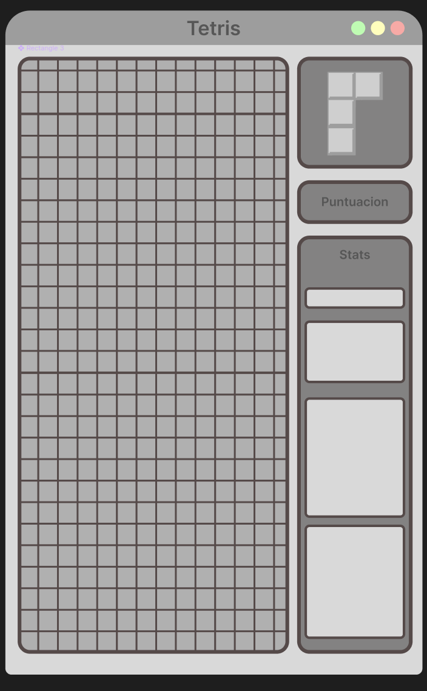

# Proyecto Tetris

(DOCUMENTACIÓN EN DESARROLLO)

# 1. Introducción

El presente proyecto recoge los puntos esenciales para el desarrollo de una versión del clásico videojuego Tetris para PC, compatible con los sistemas operativos Windows, macOS y Linux. Este proyecto nace con una doble finalidad: por un lado, ofrecer al usuario final una experiencia de entretenimiento y, por otro, servir como ejercicio práctico de aprendizaje para el alumno, quien a lo largo del proceso adquirirá conocimientos y habilidades fundamentales en conceptos avanzados de Java mediante el desarrollo de un videojuego.

El producto está orientado principalmente a un público adulto de 30 años en adelante, tanto hombres como mujeres, familiarizados con este tipo de juegos.

# 2. Gestión del proyecto

## Objetivos
- Crear un videojuego Tetris sin errores.
- Adquirir los conocimientos de Java para desarrollar un juego de estas características.

## Alcance
- **Funcionalidades incluidas**:
  - Interfaz gráfica (una **única ventana** de juego).
  - Juego para 1 jugador.
  - Único **modo de juego**: clásico.
    - Sistema de niveles:
      - **Aumento de nivel** por alcanzar un valor determinado de puntos.
      - **Velocidad incremental**. El aumento de nivel implica aumento de la velocidad de caída de las piezas, aumentando la dificultad del juego.
    - El juego termina cuando una pieza no cabe en el tablero.
  - **Piezas**
    - Un total de 7 piezas.
    - Cada pieza tiene un color y forma diferente.
  - **Controles** por teclado de piezas
    - Rotación de pieza.
    - Desplazamiento de pieza horizontalmente (derecha-izquierda).
    - Aceleración vertical.
    - Salto vertical (caída de pieza, *hard drop*).
  - Panel de información
    - Mostrar información de controles al usuario.
    - Contador de líneas eliminadas/completadas.
    - Puntuación actual.
    - Nivel actual.
  - Sistema de **puntuación**:
    - Contabilizar líneas completadas (empieza en 0, valor entero).
    - Multiplicador de puntos por líneas eliminadas a la vez (1: 100 pts, 2: 300 pts, 3: 500 pts, 4: 800 pts).
    - Multiplicador por rachas consecutivas (2ª vez: x1.2, 3ª vez: x1.5, 4ª+ vez: $2^{x-3}$) 4ª vez y posteriores:
    - Multiplicador = 2^(x-3) donde x es el número de eliminaciones consecutivas.
    - La racha se reinicia cuando una pieza se coloca sin eliminar ninguna línea.
  - Sistema de **incremento de nivel**:
    - Empieza en el nivel 1.
    - Nivel 2 a los 500 puntos.
    - Fórmula general de progresión:.
    - | Nivel | Cálculo   | Valor |
    - | ----- | --------- | ----- |
    - | 1     | 500 × 1²  | 500   |
    - | 2     | 500 × 2²  | 2000  |
    - | 3     | 500 × 3²  | 4500  |
    - | 4     | 500 × 4²  | 8000  |
    - | 5     | 500 × 5²  | 12500 |
    - | 6     | 500 × 6²  | 18000 |
    - | 7     | 500 × 7²  | 24500 |
    - | 8     | 500 × 8²  | 32000 |
    - | 9     | 500 × 9²  | 40500 |
    - | 10    | 500 × 10² | 50000 |

  - **Tamaño tablero del juego**
    - Tamaño 24 altura, 10 ancho.
    - 4 Para poder aparecer las piezas

  - **Generacion de piezas**
    - Pocision de aparicion en el centro.
    - Siempre en posicion base .
    - Piezas lineales I, J, L aparecen planas(la J y la L tendran el extremo saliente mirando hacia arriba).
    - Piezas S, Z y T se mantendran de forma base igual a la imagen del Github.
    - Se usara ramdon para hacer la salida aleatoria.
    - Las piezas caen al estilo Soft drop: acelera la caída de la pieza mientras se mantiene la tecla pulsada.

- **Rotacion de piezas**
  - Las piezas se crearan dentro de un array 4x4 donde alineadas al centro derecha.
  - La rotacion sera del array completo en sentido horario.
  - Controles flechas laterales movimiento, flecha superior cambio de posicion de la ficha, inferior acelera, espacio caida instantanea haciendo Hard drop:
    La pieza cae instantáneamente hasta la posición más baja posible.

  (0, 0, 0, 0
  1, 1, 1, 1
  0, 0, 0, 0
  0, 0, 0, 0)

  (0, 0, 0, 0
  0, 1, 0, 0
  0, 1, 1, 1
  0, 0, 0, 0)

  (0, 0, 0, 0
  0, 1, 1, 0
  0, 1, 1, 0
  0, 0, 0, 0)

    (0, 0, 0, 0       (0, 0, 0, 0        (0, 0, 0, 0        (0, 1, 1, 0
    0, 0, 0, 1        0, 1, 0, 0         1, 1, 1, 0         0, 0, 1, 0
    0, 1, 1, 1        0, 1, 0, 0         1, 0, 0, 0         0, 0, 1, 0
    0, 0, 0, 0)       0, 1, 1, 0)        0, 0, 0, 0)        0, 0, 0, 0)

    (0, 0, 0, 0
    0, 0, 1, 0
    0, 1, 1, 1
    0, 0, 0, 0)

    (0, 0, 0, 0
    0, 1, 1, 0
    0, 0, 1, 1
    0, 0, 0, 0)

    (0, 0, 0, 0
    0, 0, 1, 1
    0, 1, 1, 0
    0, 0, 0, 0)

    (0, 0, 0, 1
    0, 0, 1, 0
    0, 1, 0, 0   //Secreto (0.001%)
    1, 0, 0, 0)

    (0, 0, 0, 0
    0, 0, 1, 0
    0, 0, 0, 0   //Secreto (0.001%)
    0, 0, 0, 0)

- **Funcionalidades no incluidas**:
  - Pausar juego.
  - Histórico de puntuaciones.
  - Multijugador.
  - Menú principal y ajustes de personalización.

- **Cierre de Alcance y Limitaciones**:
  - El juego se ejecutará en una ventana de dimensiones fijas para garantizar la estabilidad visual.
  - No se implementará almacenamiento en base de datos; la sesión es volátil.
  - Las piezas no pueden atravesar otras piezas ni salir del tablero.
  - Cuando una fila se llena completamente, se elimina.
  - Las filas superiores descienden una posición.

## Requisitos funcionales

- **RF1.** Representación visual y lógica de los 7 tipos de piezas (Tetriminos).
- **RF2.** Sistema de movimiento lateral y rotación de piezas detectando colisiones con el tablero.
- **RF3.** Implementación de caída acelerada y caída instantánea (*hard drop*).
- **RF4.** Algoritmo de detección, eliminación de líneas completas y desplazamiento de las superiores.
- **RF5.** Motor de puntuación que aplique bonos por líneas múltiples y rachas consecutivas.
- **RF6.** Control de niveles que incremente la velocidad de caída según la puntuación acumulada.
- **RF7.** Interfaz de usuario (HUD) para mostrar estadísticas de juego en tiempo real.

## Planificación temporal
El desarrollo se estima en **14 días de trabajo efectivo** distribuidos en **5 semanas**.

| Semana | Fase | Hitos / Actividades |
| :--- | :--- | :--- |
| **1** | **I: Diseño** | Configuración de la ventana principal y lógica de la matriz del tablero. |
| **2** | **II: Mecánicas** | Lógica de las 7 piezas, rotaciones y sistema de colisiones básico. |
| **3** | **III: Lógica** | Implementación de eliminación de líneas, sistema de puntos y rachas. |
| **4** | **IV: Progresión** | Programación de niveles, aumento de velocidad y diseño del HUD. |
| **5** | **V: Cierre** | Pruebas de errores, ajustes de dificultad y entrega de documentación. |

## Asignación de recursos
- **Humanos**: 1 desarrollador (alumno).
- **Software**: Java JDK, IDE (IntelliJ/Eclipse), Git.

# 3. Desarrollo del proyecto

## Diseño

## Arquitectura

**Trayectora en mi proyecto:**

- **1** **I: Diseño** Primera semana, use completamente la ia ara poder realizar la interfaz grafica del juego inspirandome en el boceto previamente hecho.
- **2** **II: Dibujado** Segunda semana, use parcialmente la ia para poder pintar las fichas en el tablero de juego.
- **3** **III: Rotacion** Tercera semana, use completamente la ia para poder rotar las piezas en el tablero, lo que hacia era pintarlas en el tablero y luego usar un metodo llamado rotar que lo que hacia es mover los valores de un array 4x4 uno a uno rotandolo en sentido antihorario.
- **4** **IV: Caida** cuarta semana, use parcialmente la ia para poder realizar las caidas de la pieza, aprendi sobre Timer, actualizaciones de una matriz y el tiempo de caida de las piezas, asi mismo como aumenta parcialmente el Score del jugador.
- **5** **V: Configuracion** Quinta semana, sin uso de la ia, esa semana comprendi completamente el funcionamiento de mi codigo aprendido la logica previamente usada, empeze a usar programacion orientada a objetos para poder hacer una clase Settings y que pueda configurar todo de mi juego desde ahi.
- **6** **IV: Bugs** Sexta y ultima semana, sin uso de la ia, corregi un bug de Score que tenia el juego, multiplicando constantemente la cantidad haciendo cantidades exorbitantes, corregi el giro de la piezas que al girar al lado de una pared se quedaban estancadas.

**Funcionamiento de mi codigo:**

Main es el iniciador de todo llamando a la funcion que arranca el controlador y el bucle principal del juego (Timer). A partir de ahí, el juego se apoya en una arquitectura Modelo-Vista-Controlador (MVC) para separar la lógica de los datos, la interfaz gráfica y los eventos del teclado.

- **Caída de piezas:** La gravedad está gestionada por un `Timer` de Java. En cada "tick" (actualización), la pieza activa desciende una posición en la matriz del tablero. A medida que el jugador avanza y acumula puntos, el intervalo del `Timer` se reduce, aumentando la velocidad de caída de las piezas.
- **Rotación:** Las piezas (manejadas internamente como matrices de 4x4) rotan transponiendo y reordenando sus valores en sentido antihorario. Se implementó una lógica de corrección (*Wall Kick*) para que, si el jugador gira una pieza pegada a un borde, esta se desplace y no se quede atascada en la pared.
- **Sistema de colisiones:** Antes de que una pieza se mueva o baje, se proyecta su siguiente posición en la matriz principal del tablero. Si esa posición excede los límites o ya está ocupada por otra pieza (un valor distinto de cero), se detecta la colisión. Si la colisión es hacia abajo, la pieza se detiene, sus valores se "imprimen" permanentemente en la matriz del tablero y se llama a la siguiente pieza.
- **Líneas y Puntaje (Score):** Inmediatamente después de que una pieza se queda parada, el código revisa la matriz buscando filas completamente llenas. Si encuentra una o más, las elimina, baja todas las filas superiores para llenar el hueco, y añade los puntos correspondientes al *Score*. Esta sección incluye la corrección del bug que multiplicaba constantemente la cantidad para asegurar que la puntuación sea exacta.

# 4. Propuestas de mejora
- **Animaciones**: Explosión cuando se completa una fila.
- **Modos de juego extra**: Mapa abierto lateral, cronómetro o modo difícil.
- **Menús**: Inclusión de menú principal y ajustes de sistema.